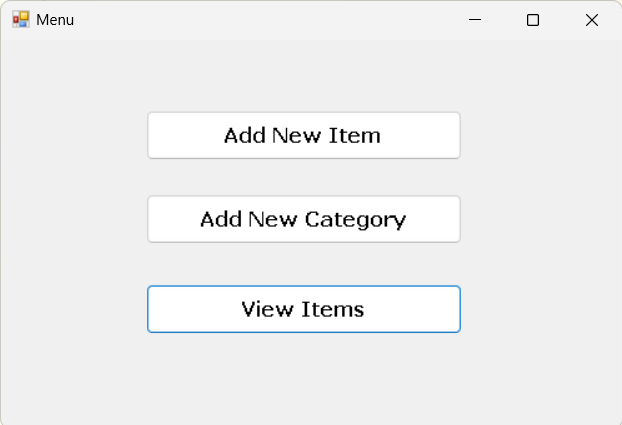
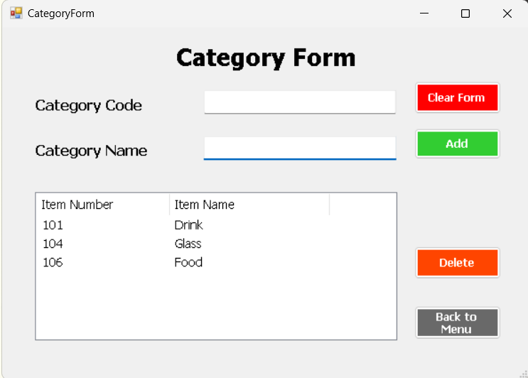
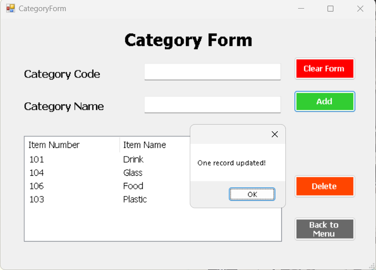
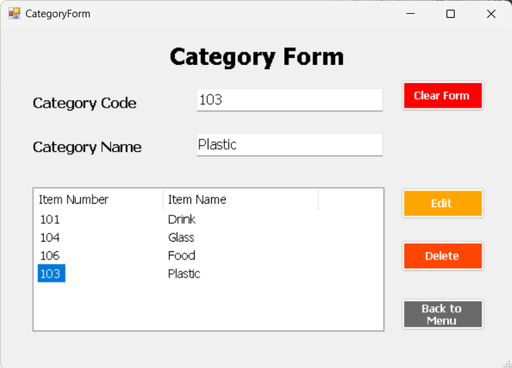
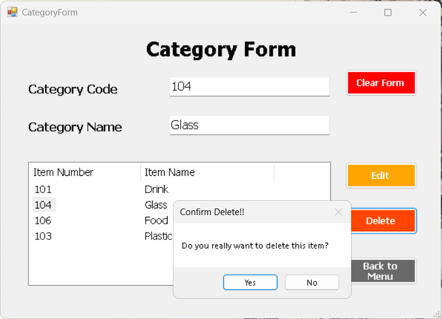
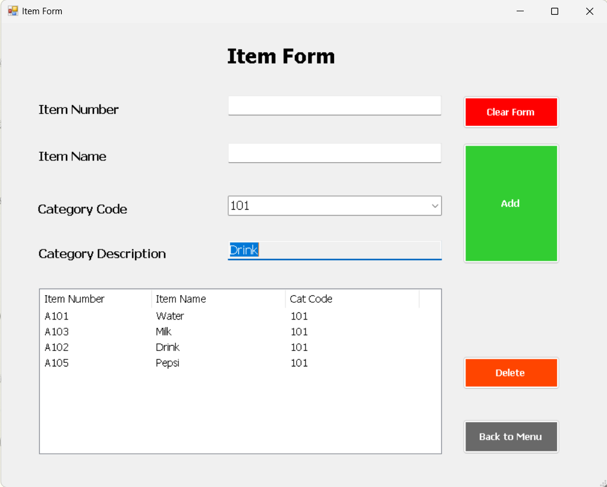
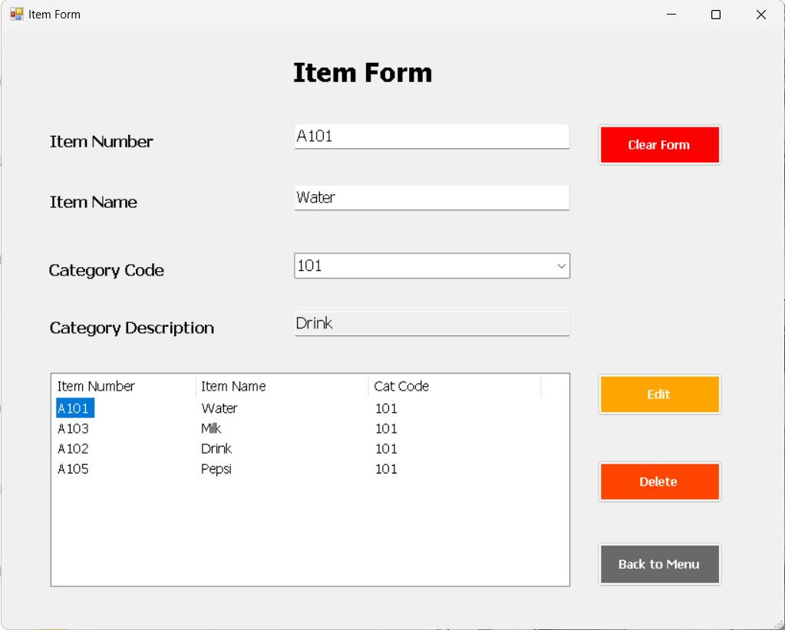
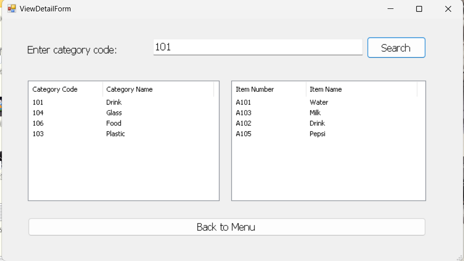

# Windows Form CRUD Operations in C#

## Introduction

This Windows Form application demonstrates CRUD (Create, Read, Update, Delete) operations and read/write text file using C# and a graphical user interface. It allows users to interact with a data set, perform basic operations, and visualize the changes on the form.

## Screenshots

Menu Form

Category Form

Category Form Add Data

Category Form Edit Data

Category Form Delete Data

Item Form

Item Form Edit Data

View And Search Categories and Items Form

